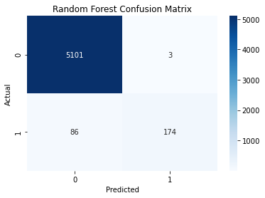
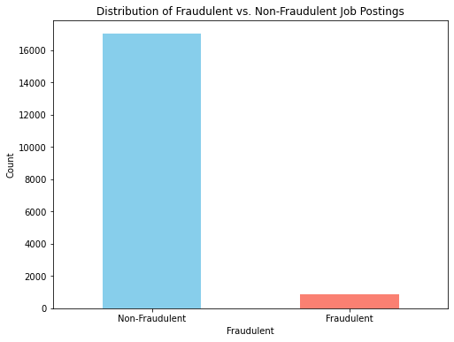
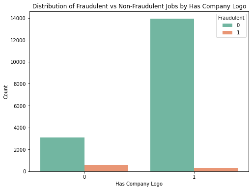
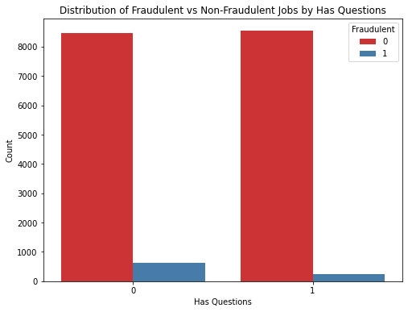
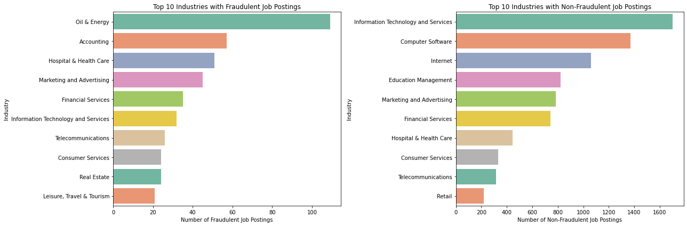

# Job postings Fraud Detection Analysis

## Project Goal
The objective of this project is to detect fraudulent job postings to improve user trust and reduce the impact of scams on job platforms and recruitment agencies.

### Overview
This project analyzes fraudulent and non-fraudulent job postings from a dataset set obtained from kaggle. This dataset contains job descriptions consisting of both real and fake job postings on an international level. The data consists of both textual information and meta-information about the jobs. This analysis aims to create classification models which can learn the job descriptions which are fraudulent based on its features such as title, location, description, and other attributes provided in the dataset. This will help the company's platform avoid scams and improve the integrity of job listings.

### Business Problem
Recruit Holdings' company aims to improve Glassdoor, its jobseeking platform, to maintain the integrity of their listings ensuring a positive user experience. However, fraudulent job postings are a growing concern not only misleading job seekers leading to financial loss and wasted effort, but also tarnishing the platform’s reputation. This results in a decrease in user engagement due to a decrease in trustworthiness, lower customer retention, and potential legal ramifications. Therefore, the company critically needs an automated solution to detect and remove fraudulent job postings before they can cause harm.

This analysis, therefore, aims in coming up with a reliable classification model that can predictively identify and filter out fraudulent job postings, thereby improving the trustworthiness of the platform and safeguarding users from potential scams to enhance user experience.
### Data
This dataset is obtained from kaggle and contains about 18K job descriptions consisting of both real and fake job postings. The dataset contains a mix of textual information and meta-information, which are crucial for understanding and predicting fraudulent job postings.

The features in this dataset include title, location, department, salary_range, company_profile, description, requirements, benefits, telecommuting, has_company_logo, has_questions, employment_type, required_experience, required_education, industry and function. The target variable in this analysis is the fraudulent column that states the fraudulent and non-fraudulent jobs.

The analysis will aims to:
Evaluate the balance between real and fake job postings to understand the potential challenges of imbalanced classes incase which specialized techniques like SMOTE or class weighting may be necessary during model training.

Identify any missing values in the dataset, especially in key features like 'Description' or 'Company Profile'.

Analyze correlations between features and the target variable to identify the most predictive features. Features such as 'Has Company Logo' and 'Has Questions' could be significant indicators of job authenticity.

### Methods
This project applies descriptive analysis as well as classification models. The models are applied to show a predictive analysis on detecting fraudulent and non-fraudulent job postings. This analysis applies Logistics Regression, Decision Trees, Random Forest and Gradient Boosting. The models' accuracy is also tested to check the best applied model for the analysis using valuation Metrics such as Precision, Recall, F1-Score and  ROC-AUC.

### Results
Based on the models' evaluation:

Logistic Regression with a ROC-AUC of 0.9067, had a high accuracy but lower recall for fraudulent postings.

Decision Tree with a ROC-AUC of 0.8521  improved recall but prone to overfitting.

Gradient Boosting with a ROC-AUC of 0.9432 had strong performance, slightly lower recall than Random Forest.

Random Forest with a ROC-AUC of 0.9777 had the best overall performance in detecting fraudulent postings. It had high precision and recall ensuring minimal false positives and negatives and a balance handling of class imbalance.

The selected model, Random Forest model, is good as it has high values for TP and TN, and low values for FP and FN, as seen in the heatmap below.

#### Distribution based on Fraudulent and Non-Fraudulent job postings
Non-Fraudulent job postings had a higher number as compared to Fraudulent job postings.

#### Distribution of Fraudulent and Non-Fraudulent job postings based on Company Logo
The distribution shows that based on job postings with or without Company logo, 
most are non-fraudulent.
However, postings with the company logo have more Non-fraudulent job postings.
Job postings without company logo have a slightly higher number of fraudulent job postings hence users should be on the look out.

#### Distribution of Fraudulent and Non-Fraudulent job postings based on Job Questions
From the graph, Non-fraudulent job postings are more for both postings with 
Questions and those without questions.
Job postings that do not have questions have a higher number of fraudulent job postings cases.
Therefore, one might conclude that job postings with questions have a low fraudulent count hence less prone to fraud cases.

#### Distribution of Fraudulent and Non-Fraudulent job postings based on Industry
Based on the type of industry, the top five indutries to watch out for with fraudulent job postings included Oil & Energy, Accounting, Hospital & Health Care, Marketing & Advertising and Financial Services.

### Conclusion
1.Key Features for Fraud Detection: Features such as the presence of a company logo, job industry and job-related questions were significant in distinguishing between fraudulent and non-fraudulent postings. Job Postings with company logo and those with questions had less fraudulent counts. Industries with higher incidences of fraudulent postings were also identified, allowing for targeted monitoring and intervention. These top five indutries to watch out for with fraudulent job postings included Oil&Energy, Accounting, Hospital&Health Care,Marketing & Advertising and Financial Services.

2.Fraudulent Job Postings Identification: The analysis successfully identified key indicators of fraudulent job postings on the platform. Models like Random Forest and Gradient Boosting demonstrated strong performance in detecting fraudulent postings, with Random Forest emerging as the best model due to its superior precision, recall, and ROC-AUC score.

3.Model Effectiveness: The Random Forest model, with its ability to balance high precision and recall, proved to be the most effective in minimizing both false positives and false negatives. This model provides a reliable foundation for the automated detection of fraudulent job postings on the Glassdoor platform.

### Recommendations

1.The company can enhance User Awareness. Informing users about common signs of fraudulent job postings, particularly in industries identified as high-risk. Providing educational resources or alerts can empower users to make safer job-seeking decisions.

2.Industry-Specific Monitoring: Given that certain industries have a higher likelihood of fraudulent postings, Glassdoor should consider implementing stricter verification protocols for job listings in these sectors. This could involve additional checks on employer legitimacy before a posting goes live.

3.Implementing the Random Forest Model: Integrating the Random Forest model into the platform’s backend to automatically flag and filter out potential fraudulent job postings. This proactive approach will help in maintaining the platform's integrity and trustworthiness.

4.Regular Model Updates: As fraud tactics evolve, regularly retraining the model with updated data is crucial to maintain its effectiveness. This includes incorporating feedback from flagged and confirmed fraudulent postings.

### Further Analysis

1.Exploration of Additional Features: Further analysis could explore additional features not included in the current dataset, such as employer ratings, historical job posting behavior, and user feedback on job listings. These features could provide deeper insights and improve model accuracy.

2.Textual Analysis Enhancement: Advanced natural language processing (NLP) techniques, such as sentiment analysis or deep learning models, could be employed to better understand the language used in job descriptions and its correlation with fraudulence. This might uncover more nuanced patterns in fraudulent postings.

3.Real-Time Fraud Detection: Investigating the feasibility of real-time fraud detection on the platform. This would involve analyzing the trade-offs between model complexity, performance, and the need for immediate response to potentially fraudulent activity.

### For more Information
See the full analysis [Jupyter Notebook](Job_Fraud_Detection_Analysis.ipynb) or review the  [Presentation](Fraudulent_Job_Postings_Analysis_Presentation.pdf)

